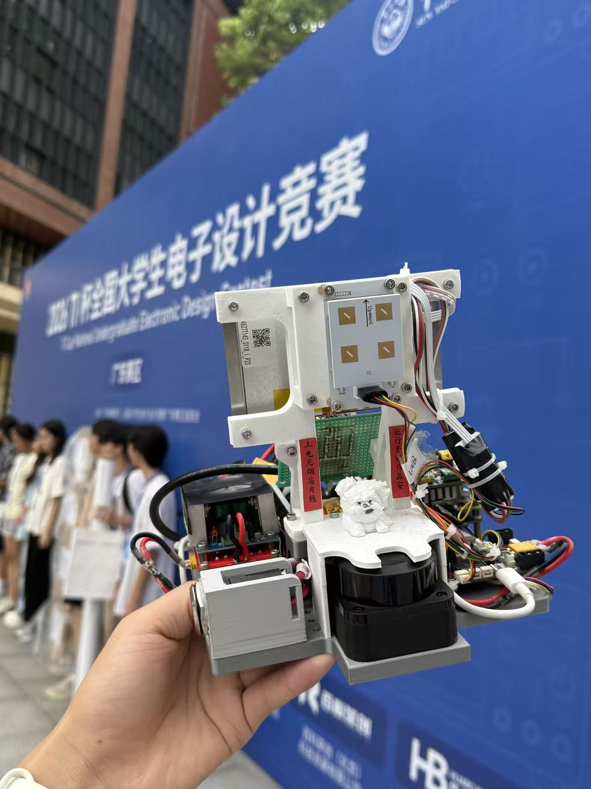
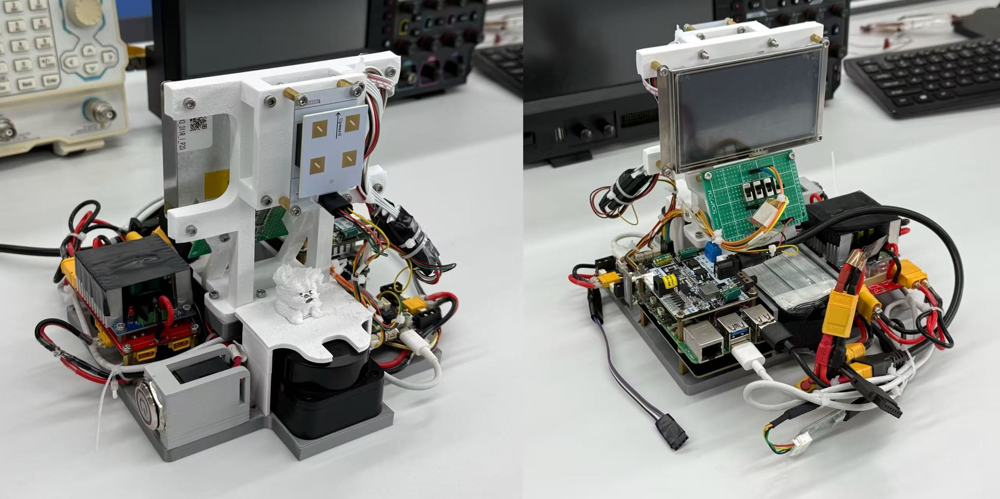
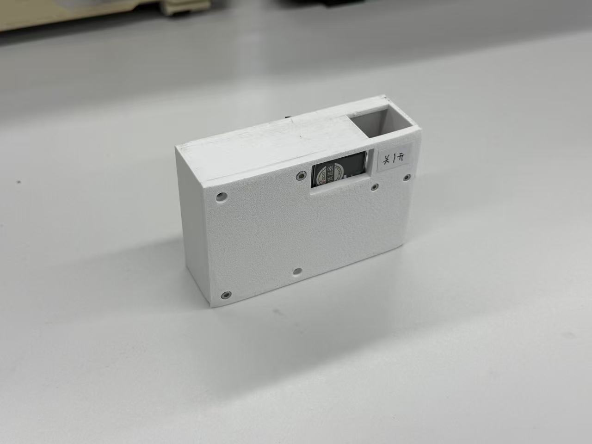
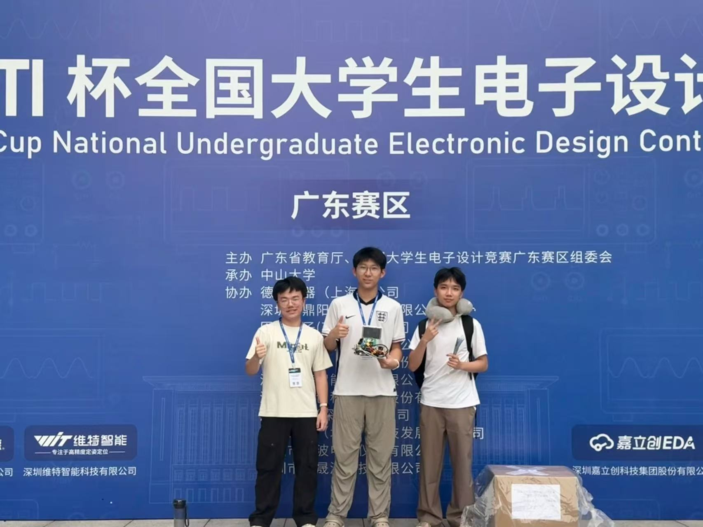

# Cyberlife — Wireless Digital Key System

A digital key and smart lock prototype developed for Problem C of the 2026 TI Cup Undergraduate Electronic Design Contest (Guangdong Division). The system combines UWB wireless communication with LiDAR localization to identify an authorized key, track its position, and trigger welcome alerts, automatic unlocking, and locking when the key leaves the designated area.

## Highlights

- **Key identification:** An STM32F103-based wireless key transmits a configurable 4-bit ID for matching against the lock's configured ID.
- **Position tracking:** A Raspberry Pi 5 running ROS 2 processes RPLIDAR C1 scans using background modeling, target extraction, and clustering, then sends distance and bearing to an STM32H723 over USB serial.
- **Sensor fusion:** Supports UWB-only and UWB/LiDAR modes, with coordinate alignment, outlier rejection, and Kalman filtering to reduce positioning drift.
- **Embedded control:** STM32H723 firmware handles UWB UART and Raspberry Pi USB CDC communication, matches key IDs, and drives proximity-based status logic, the serial display, RGB LEDs, and buzzer.
- **Integrated hardware:** A display, lights, and buzzer provide status feedback, with a custom 3D-printed enclosure and mounting structure.

**Tech stack:** STM32 · Embedded C · STM32 HAL · Keil MDK · Raspberry Pi 5 · ROS 2 · Python · UWB · LiDAR · Kalman Filter · SolidWorks

## Prototypes

  

### Digital Key

  

## Our Team

## Repository

- [`Electronics_STM32H7/`](Electronics_STM32H7/) — STM32H723 smart lock firmware, including peripheral drivers, communication, and status control, with STM32CubeMX and Keil MDK project files.

- [`Pi5_lidar/`](Pi5_lidar/) — ROS 2 workspace for LiDAR localization and serial communication.
- [`Structure/`](Structure/) — SolidWorks models and STEP files for the mechanical assembly.
- [`Report.pdf`](Report.pdf) — Project report with system design and test results (Chinese).
